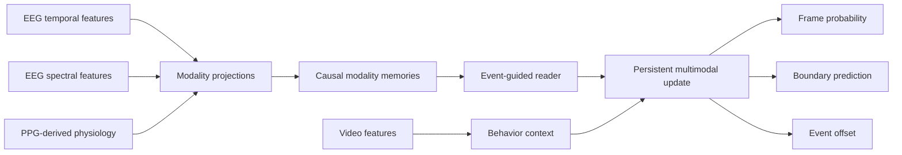

# EPT-Net

<div align="center">

**Event-guided Persistent Temporal Network for causal multimodal event recognition and localization**

[](pyproject.toml)
[](pyproject.toml)

[Overview](#overview) · [Quick start](#quick-start) · [Experiments](#experiments) · [Outputs](#outputs) · [Citation](#citation)

</div>

EPT-Net is a research implementation for continuous, causal recognition and temporal localization from synchronized EEG, PPG-derived physiology, and video features. It combines modality-specific causal memories, event-guided adaptive reading, and a persistent multimodal state to produce frame-level probabilities and temporal boundaries.

The `1011branch` implementation adds the manuscript's native-time EEG, spectral
EEG and cardiac streams, independent audiovisual event guidance, completed-word
text context, ATER and PMSU. Use [configs/paper.yaml](configs/paper.yaml) with the
same `ept train` and `ept evaluate` commands. [PAPER.md](PAPER.md) documents
preparation, frozen model loading, streaming inference and the equation-to-source
mapping. The existing configurations and result paths remain available.

## Overview

EPT-Net performs sequence-level inference over synchronized, precomputed features. At every valid time step, the model estimates the target-event probability together with its temporal extent.



The default configuration uses EEG temporal features, EEG spectral features, PPG-derived physiology, and video features. Audio and text inputs are disabled.

## Quick start

### 1. Install

```bash
git clone --branch wyw https://github.com/w2yiwen/EPT2026.git
cd EPT2026

python3 -m venv .venv
. .venv/bin/activate
python -m pip install -r requirements-lock.txt -e .
```

### 2. Prepare the data

Place the prepared feature dataset at:

```text
data/
└── processed/
    └── bci_subjects_ept/
        ├── dataset_summary.json
        ├── feature_schema.json
        ├── normalization_stats.npz
        ├── manifests/
        │   ├── sessions_all.jsonl
        │   ├── sessions_val.jsonl
        │   └── sessions_test.jsonl
        └── sessions/
            └── session_*/
                └── timeline.pt
```

The existing feature protocol reads the prepared tensors and manifests directly.
The native-time protocol also provides causal feature extraction through `ept prepare`;
its input recordings and annotations are described in [PAPER.md](PAPER.md).

## Experiments

Train EPT-Net with the main configuration:

```bash
bash scripts/train.sh configs/main.yaml
```

Evaluate a checkpoint:

```bash
bash scripts/evaluate.sh \
  configs/main.yaml \
  results/final/eptnet/seed_42/best.pt \
  results/final/eptnet/seed_42
```

Run all declared experiments and generate the public PNG figures:

```bash
bash scripts/run_experiments.sh
```

Generate PNG figures from existing results:

```bash
python figures/generate.py
```

Available configurations:

| Configuration | Purpose |
|---|---|
| `main` | Full EPT-Net |
| `fixed_reader` | Fixed-width reader ablation |
| `no_persistent` | Persistent-state ablation |
| `video_only` | Video-only ablation |
| `lstr` | LSTR comparison |
| `gatehub` | GateHUB comparison |
| `testra` | TeSTra comparison |
| `mult` | MulT comparison |

## Outputs

Completed runs are organized by experiment and seed:

```text
results/final/<experiment>/
├── aggregate.json
├── aggregate.csv
└── seed_<seed>/
    ├── resolved_config.yaml
    ├── run_metadata.json
    ├── history.json
    ├── best.pt
    ├── last.pt
    ├── test_metrics.json
    ├── test_predictions.jsonl
    ├── test_events.json
    └── figures/
        └── training_curve.png
```

The figure generator writes publication-ready PNG files to `figures/`:

- `training_curve.png`
- `model_comparison.png`
- `event_timeline.png`

## Repository structure

```text
EPT2026/
├── configs/                 # Model and ablation configurations
├── figures/                 # PNG generator and generated figures
├── scripts/                 # Training and evaluation entry points
├── src/eptnet/
│   ├── data/                # Dataset and schema readers
│   ├── evaluation/          # Metrics, decoding, and evaluation
│   ├── models/              # EPT-Net and comparison models
│   ├── training/            # Training and checkpoint management
│   └── cli/                 # Unified command-line interface
└── results/final/           # Completed runs and checkpoints
```

## Reproducibility

Each completed run retains its resolved configuration, seed, run metadata, training history, predictions, decoded events, metrics, and best and last checkpoints. Existing complete artifacts are preserved when the full experiment entry point is run again.

## Dataset availability

The dataset used in this project is available upon reasonable request. Researchers interested in reproducing the experiments or conducting related work may contact `yw_wang@smail.nju.edu.com` with their affiliation and intended use.

## Citation

Use GitHub's **Cite this repository** function, backed by [CITATION.cff](CITATION.cff), when citing this software release.

## License

No open-source license has been selected. See [LICENSE_STATUS.md](LICENSE_STATUS.md) and [THIRD_PARTY.md](THIRD_PARTY.md) for the current source and dependency terms.
