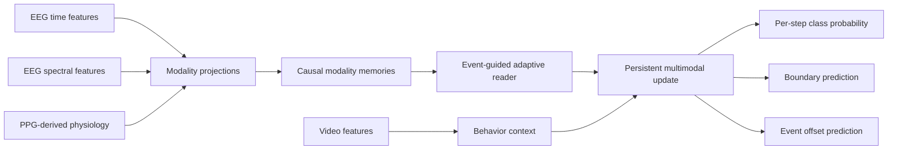

# EPT-Net

<div align="center">

**Event-guided Persistent Temporal Network for causal multimodal event recognition and localization**

[](https://github.com/w2yiwen/EPT2026/actions/workflows/ci.yml)
[](pyproject.toml)
[](pyproject.toml)

[Overview](#overview) · [Quick start](#quick-start) · [Experiments](#reproduce-the-complete-experiment) · [Documentation](#documentation) · [Citation](#citation)

</div>

EPT-Net is a research implementation for continuous, causal recognition and temporal localization from synchronized EEG, PPG-derived physiology, and video features. It maintains modality-specific causal memories, uses event-guided adaptive reading, and updates a persistent multimodal state to produce frame-level class probabilities and event boundaries.

## Overview

The task is sequence-level inference rather than session-level classification. At every valid time step, the model predicts the probability of the target event and estimates its temporal extent.


The paper-facing configuration intentionally excludes audio and text. It consumes frozen, precomputed features and does not rerun feature extraction, alignment, or annotation.


## Quick start

### 1. Install

```bash
git clone https://github.com/w2yiwen/EPT2026.git
cd EPT2026

python3 -m venv .venv
. .venv/bin/activate
python -m pip install -r requirements-lock.txt -r requirements-figures.txt -e .
python -m pip check
```

The project is not tied to a particular GPU, driver, or cloud provider. The available device is selected through PyTorch with `DEVICE=auto`, or can be set explicitly to `cpu` or a supported accelerator.

### 2. Prepare the frozen data

The dataset is not distributed in this repository. Place the frozen artifact under a data root with the following structure:

```text
data/
└── processed/
    └── bci_subjects_ept_v6_aligned11/
        ├── dataset_summary.json
        ├── feature_schema.json
        ├── normalization_stats.npz
        ├── manifests/
        │   ├── sessions_all.jsonl
        │   ├── sessions_val.jsonl
        │   └── sessions_test.jsonl
        └── sessions/
            └── session_*/
                └── timeline.pt
```

The paper configurations resolve this artifact from `data/processed/`. If the artifact is stored elsewhere, create a local `data` symlink or copy a configuration and update its manifest paths. The code reads the existing tensors and manifests but never regenerates or repairs them. Further details are in [DATA.md](DATA.md).

### 3. Validate the installation

```bash
DEVICE=auto bash scripts/experiments/run_marlin11_complete.sh validate
```

This command runs the test suite, configuration dry runs, frozen-data integrity checks, six bounded smoke runs, and figure-export QA. It does **not** launch the full experiment or report smoke outputs as paper results.

## Reproduce the complete experiment

After validation succeeds, the complete training, evaluation, aggregation, and figure pipeline is one command:

```bash
DEVICE=auto bash scripts/experiments/run_marlin11_complete.sh formal
```

The entry point performs the following operations in order:

1. verifies the code, configuration, frozen manifests, tensor identities, cohort policy, and comparison fairness;
2. trains the main models and diagnostic variants using the declared seeds;
3. evaluates the selected checkpoints on the fixed training-included evaluation views;
4. exports per-step predictions, decoded events, metrics, and cross-run aggregates;
5. generates the declared paper figures as PDF, SVG, and 500 dpi PNG files with QA reports.

A qualitative sample identifier is declared before training and stored in `results/marlin11_shortpaper_figure_sample_id.txt`. Repeated runs must reuse the same identifier, preventing post-hoc selection based on visual appearance.

### Experiment matrix

| Group | Model / diagnostic | Modalities | Configuration |
|---|---|---|---:|---|
| Main | EPT-Net | EEG + PPG + video |[`eptnet_marlin11_eeg_ppg_video.yaml`](configs/eptnet_marlin11_eeg_ppg_video.yaml) |
| Main | Early-fusion GRU | EEG + PPG + video | [`gru_marlin11_eeg_ppg_video.yaml`](configs/gru_marlin11_eeg_ppg_video.yaml) |
| Main | Fusion Transformer | EEG + PPG + video | [`transformer_marlin11_eeg_ppg_video.yaml`](configs/transformer_marlin11_eeg_ppg_video.yaml) |
| Input diagnostic | EPT-Net, video only | video |  [`eptnet_marlin11_video_only.yaml`](configs/eptnet_marlin11_video_only.yaml) |
| Mechanism diagnostic | EPT-Net, fixed reader | EEG + PPG + video | [`eptnet_marlin11_fixed_reader.yaml`](configs/eptnet_marlin11_fixed_reader.yaml) |
| Mechanism diagnostic | EPT-Net, no persistent state | EEG + PPG + video | [`eptnet_marlin11_no_persistent.yaml`](configs/eptnet_marlin11_no_persistent.yaml) |

All configurations use the same frozen 11-session training cohort. Audio and text are disabled in every paper-facing run.

### Evaluation

The pipeline reports complementary frame- and event-level metrics:

- probability quality: average precision, Brier score, and negative log-likelihood;
- frame classification: macro-F1, balanced accuracy, and AUROC;
- boundary quality: boundary F1;
- event localization: event F1 at IoU 0.5, event AP at IoU 0.3/0.5/0.7, and event mAP;
- temporal behavior: detection delay and early-recall summaries.

Because the evaluation views overlap the training cohort, these measurements characterize the fixed protocol only. They are not held-out generalization estimates.

## Outputs

Each formal run is written to an isolated directory:

```text
results/<experiment>/seed_<seed>/
├── resolved_config.yaml
├── run_metadata.json
├── history.json
├── best.pt
├── last.pt
├── test_metrics.json
├── test_predictions.jsonl
├── test_events.json
└── figures/
    ├── training_history.csv
    ├── fig_training_dynamics.pdf
    ├── fig_training_dynamics.png
    └── training_figure_manifest.json
```

Experiment directories additionally contain `aggregate.json` and `aggregate.csv`. Paper figures are exported under `fig/fig04_dynamic_tracking/` and `fig/fig05_modality_evidence/`, together with their source data and QA reports.

The repository does not ship numerical paper results or pretrained checkpoints. These outputs are produced only by the formal pipeline from the frozen artifact.

## Repository structure

```text
EPT2026/
├── configs/                 # Defaults and paper experiment configurations
├── docs/                    # Architecture, protocol, and reproducibility records
├── fig/                     # Figure contracts and deterministic generators
├── scripts/
│   ├── audit/               # Repository and release audits
│   ├── experiments/         # Validation and formal experiment entry points
│   └── reporting/           # Result aggregation and reporting utilities
├── src/eptnet/
│   ├── data/                # Frozen artifact readers and validation
│   ├── evaluation/          # Metrics, event decoding, and evaluation
│   ├── models/              # EPT-Net and comparison models
│   ├── training/            # Training, checkpoints, and run metadata
│   └── cli/                 # Unified `ept` command-line interface
└── tests/                   # Unit and contract tests
```

See [the architecture guide](docs/architecture.md) for ownership boundaries and the role of each module.

## Reproducibility safeguards

Every formal run is designed to preserve the evidence needed to audit its origin:

- resolved configuration and declared seed;
- Git revision and source fingerprint;
- frozen manifest and session-tensor identities;
- cohort policy and label semantics;
- environment, device, and determinism metadata;
- best and last checkpoints, training history, predictions, and decoded events;
- aggregate identities and figure input manifests;
- fail-closed checks that prevent incompatible or partial outputs from being silently reused.

The complete evidence contract is documented in [docs/reproducibility.md](docs/reproducibility.md), and figure inputs and QA requirements are defined in [fig/FIGURE_CONTRACTS.md](fig/FIGURE_CONTRACTS.md).

## Release status

| Artifact | Status |
|---|---|
| Source code and configurations | Public in this repository |
| Paper | No public paper link is declared yet |
| Frozen dataset | Not redistributed; no public access procedure is declared yet |
| Pretrained checkpoints | Not released |
| Numerical results | Not bundled; generated by the formal pipeline |
| License | No open-source license has been selected; see [LICENSE_STATUS.md](LICENSE_STATUS.md) |

Public source visibility does not by itself grant permission to copy, modify, or redistribute the code. Third-party dependency and asset boundaries are recorded in [THIRD_PARTY.md](THIRD_PARTY.md).

## Documentation

- [Experiment design](docs/experiment_design.md): task definition, hypotheses, metrics, and comparison matrix.
- [Reproducibility protocol](docs/reproducibility.md): frozen evidence, run identity, recovery, and reporting rules.
- [Architecture](docs/architecture.md): package responsibilities and dependency boundaries.
- [Figure contracts](fig/FIGURE_CONTRACTS.md): source-data identity, sample declaration, export, and QA.
- [Data statement](DATA.md): expected artifact structure and redistribution status.
- [Third-party statement](THIRD_PARTY.md): dependencies and external-asset boundary.

## Citation

The associated paper citation will be added when a public paper record is available. Until then, use GitHub's **Cite this repository** function, which reads the repository metadata from [CITATION.cff](CITATION.cff), when citing this software release.
